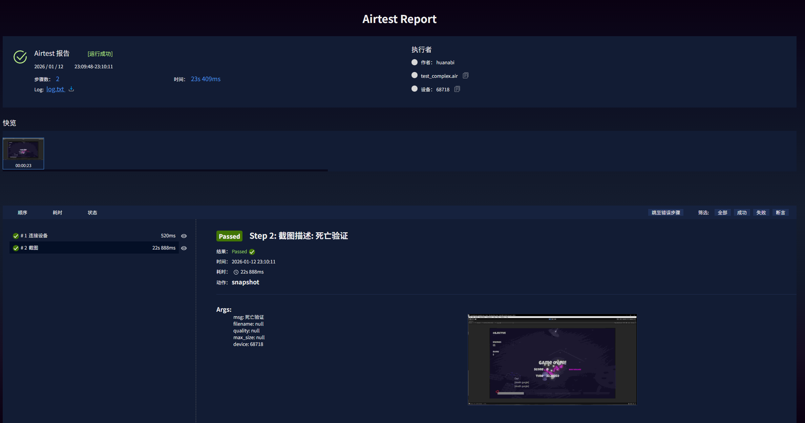

# Survival Shooter Automation Framework 

> 基于 **Airtest + Poco + Python** 的 Unity 游戏全流程自动化测试框架。
> 实现了 **POM** 设计模式，解决了 Windows 平台下的 DirectInput 输入兼容性问题。

## 📸 运行效果

## 🏗️ 项目架构

| 模块 | 说明 |
| :--- | :--- |
| **ActionLibrary.py** | **底层驱动层**。封装 `pydirectinput` 实现硬件级键鼠模拟，解决 Unity `Input.GetAxis` 无法接收虚拟信号的问题。 |
| **GamePages.py** | **业务逻辑层 (POM)**。封装 `MainPage` 和 `BattlePage`，实现业务与代码分离，包含状态机逻辑。 |
| **test_complex.air** | **测试用例层**。包含状态机测试，验证 "战斗 -> 死亡 -> 自动重置 -> 状态归零" 的完整闭环。 |

## 🚀 核心难点与解决方案

### 1. 底层输入兼容性 (Input System Conflict)
* **问题**：Unity 引擎在 Windows 窗口模式下，会屏蔽常规自动化工具（如 `pyautogui`）的虚拟按键信号。
* **解决**：引入 `pydirectinput` 库，通过 **DirectX Scan Codes** 发送硬件级输入信号，成功接管角色移动与射击控制。

### 2. 游戏状态闭环 (State Machine Testing)
* **问题**：游戏死亡后会自动重载场景，导致传统的“点击重开”逻辑失效。
* **解决**：设计了智能监听算法 `wait_for_auto_restart`，通过轮询 **分数(Score)** 与 **UI状态(GameOverText)** 的组合条件，精准判断游戏是否完成重置。
